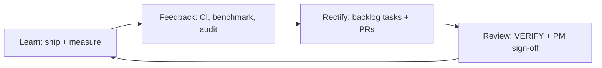

# QUANTAN Continuous Improvement Loop

**Model:** Learn → Feedback → Rectify → Review  
**Companion plan:** `workspace/DEVELOPMENT_PLAN_2026-05-26.md`  
**Boot:** `AGENT.md` + `workspace/SESSION_STATE.json` + `workspace/MEMORY_LOG.md`

---

## Loop diagram



| Stage | Activities | Artifacts |
|-------|------------|-----------|
| **Learn** | Merge features; run benchmarks; weekly data refresh | `scripts/benchmark-results.json`, commits |
| **Feedback** | CI failures, WR regression, npm audit, grep hygiene, manual QA | `MEMORY_LOG`, GitHub Checks, `reviews/npm-audit-*.md` |
| **Rectify** | Pick backlog item; smallest diff; verify_commands | PR, `IMPROVEMENT_BACKLOG.json` status |
| **Review** | VERIFY A–F; update HANDOFF; human decisions | `SESSION_STATE`, `HANDOFF.md` |

---

## Cadence

### Weekly (Sunday UTC aligned with data refresh)

1. GitHub Action **Weekly Data Refresh** runs (`refresh-data.yml`).
2. Run `npm run benchmark` locally or rely on **Nightly Benchmark** (`nightly-backtest.yml`, weekdays 06:00 UTC).
3. Log net WR + date to `workspace/MEMORY_LOG.md` Verification Log (see 2026-06-02 HANDOVER-MENU entry).
4. If portfolio-sim touched: `npm run portfolio:backtest` and compare to `reviews/invariants-baseline.md` §2.

| Step | Command / action | Owner |
|------|------------------|-------|
| 1. Data refresh | GitHub Action `Weekly Data Refresh` or `node scripts/fetchBacktestData.mjs` | CI / **Implementer** |
| 2. Canonical benchmark | `npm run benchmark` — record WR in `MEMORY_LOG` | **Verifier** |
| 3. Enhanced check (informational) | `npm run benchmark:enhanced` — do not promote if < 56.35% | **Verifier** |
| 4. Backlog grooming | Triage `pending`/`partial`; add IDs; link PRs | **Cursor coordinator** |
| 5. SESSION_STATE | Bump `last_inspection`; close stale tasks | **Cursor coordinator** |

**WR gate:** aggregate **≥ 55%** minimum; treat **< 56.35%** as regression investigation (not always revert — document cause).

### Per PR (signal-touching or any `lib/backtest/*`, `lib/optimize/*`, `signals.ts`)

| Step | Required when |
|------|----------------|
| `npm run typecheck` | Always |
| `npm run test` | Always |
| `npm run benchmark` | Signal/backtest/optimize changes |
| `npm run test:coverage` | When coverage include/exclude changes |
| Snapshot update | Intentional UI change only (Q-058 pattern) |
| Backlog item → `done` + `completed_at` | Only after verify passes |

**PR checklist (paste in description):**

```markdown
- [ ] typecheck clean
- [ ] vitest pass (count ≥ floor in invariants-baseline.md)
- [ ] benchmark WR ≥ 55% (attach % if touched signals)
- [ ] no secrets in diff
- [ ] IMPROVEMENT_BACKLOG.json updated (if closing Q-*)
```

### Monthly

| Step | Action |
|------|--------|
| `npm audit --omit=dev` | Triage; file review doc under `reviews/npm-audit-YYYY-MM-DD.md` |
| Dependency review | Minor/patch bumps in dedicated PR; no `audit fix --force` |
| Invariants review | `reviews/invariants-baseline.md` still matches reality |
| Stale worktree check | Root vs `.claude/worktrees/*` drift |
| Phase plan checkpoint | Update `DEVELOPMENT_PLAN_*.md` or append amendment section |

---

## Agent roles

| Role | Agent type | When to use |
|------|------------|-------------|
| **Cursor coordinator** | Parent / TPM agent | Planning, HANDOFF, SESSION_STATE, backlog grooming, multi-PR sequencing |
| **Implementer** | Default coding agent | Feature work, decomp, script runs |
| **Verifier** | `verifier` subagent or dedicated pass | Post-PR VERIFY A–F; benchmark double-run |
| **ci-investigator** | `ci-investigator` subagent | Single failing GitHub check root-cause |

**Rule:** Coordinator does not skip Verify after Implementer marks done.

### VERIFY A–F (from AGENT hook / project practice)

| Code | Check |
|------|--------|
| **A** | Tests pass on touched scope (`npm run test`) |
| **B** | Typecheck (`npm run typecheck`) |
| **C** | No hardcoded secrets |
| **D** | No raw credential strings in source |
| **E** | Matches architecture / plan acceptance criteria |
| **F** | No NaN / data leakage in quant pipelines (benchmark sanity) |

Log results in `workspace/MEMORY_LOG.md` Verification Log table.

### INSPECT 1–6 (session start)

| Code | Check |
|------|--------|
| **INSPECT-1** | List `workspace/` (2 levels) |
| **INSPECT-2** | `SESSION_STATE.json` current? |
| **INSPECT-3** | `grep -rn "TODO\|FIXME\|BROKEN\|UNTESTED\|HACK"` in source |
| **INSPECT-4** | New secrets → names in `.env.template` only |
| **INSPECT-5** | Unresolved BLOCKERs in `MEMORY_LOG.md` |
| **INSPECT-6** | Last test/benchmark result in SESSION_STATE |

---

## Feedback channels

### `workspace/MEMORY_LOG.md`

- **Verification Log** — timestamped VERIFY A–F per task  
- **Session History** — narrative handoff between agents  
- **SECURITY ALERTS** — incident tracking  

### `workspace/SESSION_STATE.json`

- `last_inspection` — machine-readable snapshot (branch, WR, test count)  
- `tasks[]` — program-level work units with `backlog_refs`, `verify_commands`, `human_blocker`  
- `blockers[]` — escalations needing PM  
- `checkpoint` — context > 80% handoff  

### `workspace/IMPROVEMENT_BACKLOG.json`

Array of task objects. Core fields:

| Field | Purpose |
|-------|---------|
| `id` | Q-### or Q-###-NEW |
| `title`, `domain`, `priority`, `status` | Triage |
| `acceptance_criteria[]` | Definition of done |
| `verify_commands[]` | Runnable proof |
| `files[]` | Blast radius |
| `phase15_sprint` / `dev_plan_phase` | Sprint alignment (optional) |
| `human_blocker` | Requires PM (optional) |
| `owner_role` | RACI hint (optional) |

Schema reference: `workspace/BACKLOG_SCHEMA.json`

### Other inputs

- `workspace/HANDOFF.md` — session-end narrative (human + agents)  
- `reviews/findings-ledger.csv` — formal F1–F8 findings  
- GitHub PR comments / CI logs  
- `reviews/npm-audit-*.md` — security triage  

---

## Issue discovery (proactive)

| Source | What to look for | Action |
|--------|------------------|--------|
| `grep TODO/FIXME/HACK` | Unfinished work | Backlog item or fix |
| `npm run benchmark` | WR drop below 55% / 56.35% | Bisect; revert or document |
| CI (`ci.yml`) | test / benchmark / coverage fail | ci-investigator |
| `npm audit` | critical/high on runtime deps | Security task (Q-057 pattern) |
| Manual QA routes | `/desk`, `/stock/SPY`, `/backtest`, `/crypto/btc` | `npm run check:smoke:local` |
| LOC thresholds | QuantLab > 500, engine > 600 | Decomp tasks |
| Code review follow-ups | e.g. live-signals guards | Q-*-NEW continuation |
| Stale docs | AGENTS.md vs disk | Q-007-style reconcile |

---

## Backlog ↔ plan linkage

| `dev_plan_phase` | Primary backlog IDs |
|------------------|-------------------|
| **P0** | Q-058 (done), PR merge, Q-004 partial |
| **P1** | Q-057-NEW |
| **P2** | Q-053-NEW, Q-008 partial |
| **P3** | Q-034, Q-009, Phase 8 scripts |
| **P4** | Phase 7 monitor (new TASK-* in SESSION_STATE) |

---

## Automation hooks (current + proposed)

| Hook | Status | Notes |
|------|--------|-------|
| `Weekly Data Refresh` workflow | **Live** | Sundays 22:00 UTC — data only |
| CI: test + benchmark + typecheck | **Live** (Q-001) | WR floor in workflow |
| Nightly benchmark | **Proposed (P4)** | See DEVELOPMENT_PLAN P4 |
| Cursor pre-commit benchmark | **Deferred** | CI sufficient after P0 |
| Stryker CI cron | **Partial** | Q-056 done locally; 30+ min — weekly manual OK |

---

## Escalation

1. Log blocker in `SESSION_STATE.blockers`  
2. Note in `MEMORY_LOG` Session History  
3. Tag **Owner (PM)** for: Next.js version, Vercel env, merge approval, legal/Polygon  

**Never:** `npm audit fix --force` (breaks `next-auth`).

---

---

## Commercialization track (research desk)

| Milestone | Criteria | Status (2026-05-26) |
|-----------|----------|---------------------|
| **M1 — Reproducible core** | P0 on `main`; canonical worktree; invariants | **Done** (`2ee18e3`) |
| **M2 — Honest analytics** | Stubs labeled; WFA + scenario P&L fixed | **In progress** |
| **M3 — Security baseline** | Next.js CVE patch; CSP enforce scheduled | **Partial** (`next@14.2.35`) |
| **M4 — Maintainability** | QuantLab ≤500 LOC | **Partial** (~1410 LOC; `quantlab/` extract) |
| **M5 — Continuous quality** | Nightly benchmark workflow | **Done** (`nightly-backtest.yml`) |

Cross-repo OSS comparison: [`reviews/OSS-BENCHMARK-2026-05-26.md`](../reviews/OSS-BENCHMARK-2026-05-26.md).

---

*Maintained by program lead. Update when cadence or floors change.*
