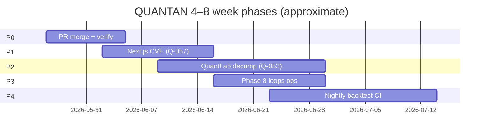

# QUANTAN Development Plan — 2026-05-26

**Horizon:** 4–8 weeks (through July 2026)  
**Program lead artifact:** complements `reviews/PHASE-16-PLAN.md`, `workspace/HANDOFF.md`, `workspace/IMPROVEMENT_BACKLOG.json`  
**Operational loop:** `workspace/CONTINUOUS_IMPROVEMENT_LOOP.md`  
**Canonical code tree:** `.claude/worktrees/competent-wu-a84629` (branch `fix/options-investigation` / open PR branches) — **not** stale repo root unless explicitly synced.

---

## Global guardrails (all phases)

| Guard | Floor | Command / source |
|-------|-------|------------------|
| **Canonical signal benchmark WR** | **≥ 55%** (project rule); **≥ 56.35%** (invariants); CI hard-fail **< 55.85%** when Q-001 job runs | `npm run benchmark` |
| **Tests** | No regression vs `reviews/invariants-baseline.md` §3 (re-baseline after major merges) | `npm run test` |
| **Typecheck** | Clean | `npm run typecheck` |
| **Enhanced path** | Stay **feature-flagged off** until aggregate WR ≥ 56.35% (Q-009) | `npm run benchmark:enhanced` |
| **Portfolio sim WR** | Document only; **54.66%** best combo is informational, not the 56-instrument gate | `npm run portfolio:backtest` |

**Re-freeze trigger:** After Q-057-NEW (Next.js) lands, run benchmark twice; if WR shifts > 50 bps, amend `reviews/invariants-baseline.md` with dated row.

---

## Phase map (P0 → P4)



Phases may overlap; **P0 blocks production confidence**; **P1 blocks security sign-off**; **P2** depends on Q-058-NEW snapshots + merged PR base.

---

## P0 — PR merge + verification (Week 1)

**Goal:** Land in-flight Phase 16 work on `main` with full VERIFY and frozen baselines updated.

| Item | Owner | Backlog / PR | Acceptance criteria |
|------|-------|--------------|---------------------|
| Merge **PR #17** (Q-058 snapshots + npm-audit triage) | **Owner (PM)** + **Implementer** | Q-058-NEW | CI green; `npm run test` ≥ prior floor; snapshots committed |
| Merge **PR #18** (Q-054 backtest decomp 887→268 LOC) | **Owner (PM)** + **Implementer** | Q-054-NEW | `wc -l app/backtest/page.tsx` ≤ 300 (stretch ≤ 200 later); smoke `/backtest` |
| Merge **PR #19** (live-signals null-guards) | **Implementer** | Follow-up from code review | 7 guard fixes; +regression tests; no benchmark regression |
| Post-merge verification pass | **Verifier** | AGENT.md VERIFY A–F | typecheck clean; vitest full pass; `npm run benchmark` WR **≥ 55%** (target maintain **≥ 57%**) |
| Update `workspace/HANDOFF.md` + `SESSION_STATE` | **Cursor coordinator** | — | `last_inspection` reflects main HEAD; open PR list empty |
| Sync stale **repo root** with worktree or document drift | **Cursor coordinator** | — | Single canonical path in HANDOFF; agents stop editing root by mistake |

**Verify commands (gate):**

```bash
npm run typecheck
npm run test
npm run benchmark    # aggregate WR >= 55% (fail below 55.85% once CI enforced)
npm run check:ci     # optional smoke/data gate
```

**Risks:** Merging #18 without #19 leaves known null-guard debt (acceptable only if PM accepts follow-up within 48h).

---

## P1 — Security: Next.js CVEs (Q-057-NEW) (Weeks 1–3)

**Goal:** Close critical advisories on `next@14.2.15` without breaking CSP (Q-040), CSRF (Q-055), or image allowlist (Q-029).

**Owner:** **Owner (PM)** chooses target line; **Implementer** executes; **Verifier** runs dual benchmark.

### Upgrade options (pros / cons)

| Target | Pros | Cons | When to choose |
|--------|------|------|----------------|
| **14.x latest patch** (stay on React 18) | Smallest diff; `next-auth@4` unchanged; middleware/CSP patterns mostly stable | **May not close all 23 CVEs** — must map each advisory `fixed in` vs chosen version | Short-term patch if audit proves sufficient |
| **15.x** (Next 15 + React 19) | Closes most 14.x CVEs; supported LTS path; incremental from 14 | React 19 peer bumps; App Router + caching behavior changes; test all API routes + middleware; snapshot tests (Q-058) required | **Recommended default** if 14.x patch insufficient |
| **16.x** | Maximum CVE closure; aligns with `npm audit fix --force` suggestion | **Two semver majors**; partial prerendering / config migration; highest blast radius; `next-auth` compatibility must be validated (do **not** use `audit fix --force` — downgrades auth) | Only if PM accepts multi-day migration + staged rollout |

**Acceptance criteria (Q-057-NEW):**

- `npm audit --omit=dev` shows **no critical** on `next`
- Middleware auth bypass + CSP nonce XSS advisories verified closed (manual + docs)
- Q-055 CSRF cookie behavior unchanged (run `__tests__/api/csrf.test.ts`)
- `npm run typecheck`, `npm run test`, `npm run benchmark` green; **WR ≥ 55%** (unchanged ± 0.5 pp)
- Q-058 snapshots updated only if intentional UI change

**Blocked by human decision:** see §Human decisions — Next.js version.

**Coordinate:** Q-040-NEW CSP enforce flip (`QUANTAN_CSP_ENFORCE=1`) should be scheduled **after** Next.js stabilizes.

---

## P2 — QuantLabPanel decomposition (Q-053-NEW) (Weeks 2–5)

**Goal:** Reduce `components/stock/QuantLabPanel.tsx` from **~1684 LOC** to **≤ 500 LOC** shell + **5 sub-tabs ≤ 400 LOC each**.

| Track | Owner | Deliverable |
|-------|-------|-------------|
| Design / state plumbing | **Implementer** (+ Plan pass) | Tab-scoped state boundaries; shared hooks extracted first |
| Extract tabs | **Implementer** | `ValuationTab`, `TechnicalsTab`, `FrameworksTab`, `LlmAnalysisTab`, `EarningsTab` |
| Regression | **Verifier** | Q-058 snapshots + `npm run check:smoke:local` on `/stock/[ticker]` |

**Approach:**

1. **Inventory** — map data-fetch and tab-local state (6 tabs; cross-tab shared props are the risk).
2. **Extract leaf UI first** — mirrors Q-054 success (mechanical moves, no behavior change).
3. **Introduce `QuantLabShell.tsx`** — routing between tabs; keep fetch orchestration in shell until stable.
4. **Snapshot pin** — extend Q-058 tests per tab loading/error if needed.

**Risks:**

| Risk | Mitigation |
|------|------------|
| State drift across tabs | Explicit context provider or props-down contract doc in PR |
| SSE / live price coupling | Reuse `hooks/useLiveQuote`; test unmount cleanup |
| LLM tab side effects | Mock fetch in tests; feature-flag expensive calls |
| Scope creep into KLineChart (1014 LOC) | Out of scope — file separate backlog item post-Q-053 |

**Acceptance:** `wc -l components/stock/QuantLabPanel.tsx` ≤ 500; typecheck + vitest + benchmark WR **≥ 55%**; snapshots pass.

---

## P3 — Phase 8 optimization loops (Weeks 3–5)

**Goal:** Operationalize AGENTS.md Phase 8 — run, document, and **gate** parameter promotion (do not ship Loop 1 winners to production).

| Loop | Script | npm script | Status (2026-05-26) |
|------|--------|------------|---------------------|
| Loop 1 | `scripts/optimize-grid.ts` | `npm run optimize:grid` | Exists; `optimization-results-loop1.json`; **OOS WR ~25.73%** — not production-ready (Q-034) |
| Loop 2 | `scripts/benchmark-enhanced.ts` | `npm run benchmark:enhanced` | Exists; **52.63% WR** (−3.72 pp vs baseline) — keep flagged off (Q-009) |
| Loop 3 | `scripts/portfolio-backtest.ts` | `npm run portfolio:backtest` | Exists; results in `portfolio-backtest-results.json` (WR **54.66%** best) |

**Owners:** **Implementer** (runs + docs); **Verifier** (benchmark guard); **Cursor coordinator** (promotion policy).

**Acceptance criteria:**

- [ ] Re-run Loop 1 on fresh `scripts/backtestData/` after weekly refresh; archive JSON with date stamp
- [ ] Loop 2: apply `getProfileForTicker()` sector gates in `benchmark-enhanced.ts` per AGENTS.md; document delta vs baseline
- [ ] Loop 3: portfolio backtest re-run; update `reviews/invariants-baseline.md` §2 if metrics shift > 1 pp
- [ ] Written promotion rule in `reviews/optimization-loop1.md`: **no default param change** unless enhanced WR ≥ **56.35%** and OOS improvement ≥ 0
- [ ] Optional: wire top-N combos to feature flag env (names only in `.env.template`)

**Benchmark guard:** Any change touching `lib/backtest/signals.ts`, `exitRules.ts`, `engine.ts`, `lib/optimize/*` → mandatory `npm run benchmark` before merge.

---

## P4 — Monitoring / nightly backtest CI (Weeks 5–8)

**Goal:** Detect signal drift and data staleness without manual runs.

| Deliverable | Owner | Notes |
|-------------|-------|-------|
| `.github/workflows/nightly-backtest.yml` | **Implementer** | Schedule: daily or weekdays 06:00 UTC; `npm run benchmark`; fail if WR < **55%** (or 55.85% aligned with CI) |
| Extend `refresh-data.yml` or separate job | **Implementer** | Weekly data refresh already exists — add benchmark step post-refresh on Sundays |
| `app/monitor/page.tsx` (optional) | **Implementer** | Rolling 30d WR from committed `scripts/benchmark-results.json` history |
| Alert channel | **Owner (PM)** | GitHub Actions failure → email/Slack (configure in repo settings) |

**Acceptance:**

- Scheduled workflow runs on `main` with green default
- Failed run opens/reminds via existing CI notifications
- Document runbook in `workspace/CONTINUOUS_IMPROVEMENT_LOOP.md`

**Existing partial assets:** `lib/qa/signalTracker.ts`, Phase 7 plan in AGENTS.md — wire or document deferral.

---

## Workspace filesystem optimizations (proposed)

Documented here; **minimal code impact** — see `workspace/BACKLOG_SCHEMA.json` and optional backlog fields.

| Change | Benefit | Implementation |
|--------|---------|----------------|
| `SESSION_STATE.tasks[]` enriched schema | Links tasks → backlog IDs, human blockers, verify commands | **Done** in `SESSION_STATE.json` (this initiative) |
| `workspace/BACKLOG_SCHEMA.json` | Documents optional fields without breaking array parsers | **Created** |
| Optional `dev_plan_phase`, `owner_role`, `human_blocker` on backlog items | TPM filtering in jq/scripts | **Applied** to Q-004, Q-053, Q-057 only |
| `workspace/DEVELOPMENT_PLAN_*.md` dated snapshots | Historical program view | This file |
| Pre-merge hook (future) | Block PR if signal paths touched without benchmark artifact | `.cursor/hooks` or CI only — **defer** until P0 merges |
| `USAGE_MONITOR.json` automation | Agent context warnings | Manual update every ~10 actions per AGENT.md |

**Do not** wrap `IMPROVEMENT_BACKLOG.json` in an object root — downstream tools expect a JSON array.

---

## RACI summary

| Role | Responsibility |
|------|----------------|
| **Owner (PM)** | Merge approval, Next.js tier, Vercel env (`QUANTAN_FRED_PREWARM`), CSP enforce timing |
| **Cursor coordinator** | HANDOFF, SESSION_STATE, backlog grooming, plan updates |
| **Implementer** | Feature PRs, decomp, scripts |
| **Verifier** | VERIFY A–F after each task |
| **ci-investigator** | GitHub Actions failures, audit `--force` traps |

---

## Human decisions required

1. **Next.js target version** (14 patch vs 15 vs 16) — unblocks Q-057-NEW  
2. **`QUANTAN_FRED_PREWARM=1` on Vercel** — unblocks Q-004 prod Sharpe/Sortino truth  
3. **PR merge order** — #17 → #18 → #19 recommended  
4. **CSP enforce date** — after Next.js + 7d clean Report-Only  
5. **Nightly benchmark threshold** — 55% vs 55.85% vs 56.35% for alerts  

---

## References

- `workspace/HANDOFF.md` — latest session truth (2026-05-25/26)  
- `workspace/IMPROVEMENT_BACKLOG.json` — Q-053, Q-054, Q-057, Q-004  
- `reviews/invariants-baseline.md` — frozen floors  
- `AGENTS.md` — Phase 8 script specs  
- `workspace/CONTINUOUS_IMPROVEMENT_LOOP.md` — weekly/per-PR/monthly cadence  

---

*Next review: 2026-06-09 or after P0 merge + P1 decision.*
