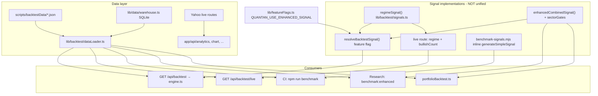

# Real-World Validity Critique — QUANTAN Signal Stack

**Date:** 2026-05-26  
**Audience:** Skeptical quant + software architect review (not marketing)  
**Repo:** `QUANTAN-sector-investment` (Drive root; canonical worktree `5922bca` per `workspace/SESSION_STATE.json`)

---

## Executive summary

**Your skepticism is warranted.** The headline **~57% aggregate win rate** (CI floor; measured **57.05–57.26%** in `reviews/invariants-baseline.md` and expert-team verify — **not 64%**) is produced by a **simplified JavaScript benchmark** (`scripts/benchmark-signals.mjs`) that is **not the same function** as production live signals, portfolio simulation, or the “enhanced” research path. Treating that number as “selective signal accuracy” or tradeable alpha would fail in live capital deployment.

**What would break first in live trading (ordered):**

1. **Signal path mismatch** — `/api/backtest/live` uses legacy `regimeSignal` + 4-indicator `bullishCount`; CI gates `benchmark-signals.mjs` (different rules); `/api/backtest` uses `engine.ts` → `resolveBacktestSignal()` (regime-only in production, enhanced in dev). Users see **different BUY/SELL** depending on screen.
2. **Metric illusion** — Canonical WR counts **20-day forward return > 0** after a BUY label, with **no round-trip costs** in `benchmark-signals.mjs`. `engine.ts` has 11 bps/side costs but WR in CI does not use the engine.
3. **Optimization dead end** — Loop 1 grid (**1,024 combos/instrument**, not a separate “220-iter batch”) yielded **~25.7% OOS WR** (`reviews/optimization-loop1.md`). Enhanced path **52.84%** vs canonical **57.05%** — correctly feature-flagged off in production (`lib/featureFlags.ts`, Q-009).
4. **Universe & stationarity** — 56 hand-picked survivors × static JSON/Yahoo history; no delisting, no point-in-time fundamentals, dip-buying tuned on 2020–2025 bull/chop.
5. **No execution layer** — Options/GEX/dark pool/Kelly/risk parity are **analytics and UI**; no broker, no fills, no shadow ledger.

**Files referenced in user brief but absent on disk:** `lib/optimize/canonicalBenchmark.ts`, `scripts/optimize-batch.ts`, `workspace/optimization-runs/BEST_CONFIG.json`. Closest equivalents: `npm run benchmark` → `benchmark-signals.mjs`; `npm run optimize:grid` → `scripts/optimize-grid.ts` + `lib/optimize/parameterSets.ts` (`LOOP1_GRID` = 1,024 combinations).

---

## 1. Signal path split (canonical vs enhanced vs API)

| Path | Entry point | Signal logic | WR / role |
|------|-------------|--------------|-----------|
| **Canonical CI benchmark** | `npm run benchmark` → `scripts/benchmark-signals.mjs` | Inline `generateSimpleSignal()` — dip vs 200SMA, slope, RSI&lt;40 | **~57%** aggregate WR — **CI regression gate** |
| **Enhanced research** | `npm run benchmark:enhanced` → `scripts/benchmark-enhanced.ts` | `enhancedCombinedSignal()` + `getProfileForTicker()` sector gates | **~52.84%** — **not production** (Q-009) |
| **Backtest API / engine** | `app/api/backtest/route.ts` → `backtestInstrument()` | `resolveBacktestSignal()` — production: **regime-only**; dev/test: enhanced if flag | Portfolio metrics; negative Sharpe in Loop 3 baseline |
| **Live signals API** | `app/api/backtest/live/route.ts` | `regimeSignal()` + **legacy** `bullishCount >= 2` (RSI/MACD/ATR/BB) | **Third variant** — comment claims “matches backtest engine” but **does not call** `resolveBacktestSignal` |
| **Portfolio backtest** | `lib/backtest/portfolioBacktest.ts` | **`enhancedCombinedSignal` directly** (not `resolveBacktestSignal`) | WR **~54.66%**, Sharpe **negative** (`reviews/invariants-baseline.md` §2) |

### Architecture (mermaid)



---

## 2. Structure critique (software architecture)

### 2.1 God components and dual paths

- **`lib/backtest/signals.ts` (~730 LOC)** — regime classifier, enhanced ensemble, Kelly heuristics, `resolveBacktestSignal` router. High coupling; comments acknowledge regime-dependent volume scoring not implemented.
- **`lib/backtest/engine.ts` (~650+ LOC)** — execution, stops, costs, walk-forward re-export. Partially extracted to `walkForward.ts` but still central.
- **`app/backtest/page.tsx`** — decomposed to ~268 LOC shell but orchestrates panels that read **different endpoints** (live vs full backtest).
- **Dual (actually triple) signal paths** — No SSOT enforced by tests between `benchmark-signals.mjs`, `resolveBacktestSignal`, and `computeInstrumentSignal` in live route.

### 2.2 Optimization loop overfitting risk

- `lib/optimize/gridSearch.ts` documents 70/30 IS/OOS and 8pp overfit cap — **sound protocol on paper**.
- **Empirical result:** `reviews/optimization-loop1.md` — aggregate OOS WR **25.73%**, 31/56 tickers with no valid combo. Dominant params cluster (low differentiation) → **structural weakness**, not missing hyperparameters.
- **No frozen holdout:** All 56 names and full history used for iteration; no “lock box” period or CPCV (see §4).
- **Missing artifacts:** No `BEST_CONFIG.json` promoted to production; enhanced remains worse than canonical.

### 2.3 Test coverage vs live gap

- **982 tests** (per SESSION_STATE) heavily unit-test **modules**, not **end-to-end signal parity**.
- `__tests__/featureFlags.test.ts` asserts enhanced **OFF** by default in test env — good — but **no test** that `/api/backtest/live` matches `backtestInstrument()` signals on same bars.
- Coverage excludes `lib/optimize`, `lib/portfolio`, `lib/ml` from thresholds (Q-051) — exactly where deployment risk lives.

### 2.4 Portfolio / risk vs UI

- `lib/portfolio/*` (VaR, stress, Kelly, risk parity) persists to **localStorage**; pages under `app/portfolio/` exist but are **not** wired to live positions or broker state.
- Tail risk banner / scenarios are **educational** unless fed real holdings.

### 2.5 Data: Yahoo single point + static backtest tape

- Live routes: `yahoo-finance2` with retries (`lib/api/reliability.ts`).
- Backtest: **pre-fetched JSON** only on Vercel (`dataLoader` — no network). Stale tape → live Yahoo move **will not match** backtested history at signal time.
- **Split adjustment:** AGENTS.md claim (yahoo `chart()` adjusted) applies to **live** fetches; backtest JSON freshness depends on `scripts/fetchBacktestData.mjs` cadence — not validated on every signal change.

### 2.6 Serverless / Vercel constraints

- No long-running grid (`optimize:grid` ~minutes) in request path; nightly workflow exists but Phase 8 runs not consistently executed.
- `better-sqlite3` native module — warehouse works locally/CI with rebuild; edge deployment limited.
- In-memory caches on API routes (60s–1h) — fine for desk, not for co-located execution.
- **No WebSocket broker**, no durable order state — platform is **research desk**, not OMS.

---

## 3. Algorithm critique — real investing failure modes

| # | Failure mode | Severity | Likelihood | Evidence in repo |
|---|----------------|----------|------------|------------------|
| 1 | **Wrong metric (WR ≠ edge)** | Critical | Certain | `benchmark-signals.mjs` scores win if 20d forward return &gt; 0; ignores expectancy, R-multiple, capacity, tail risk. Kelly uses `confidence/100` as win probability (`signals.ts` ~654) — **circular** with label construction. |
| 2 | **Signal path divergence** | Critical | Certain | Live route: `regimeSignal` + `bullishCount` (`app/api/backtest/live/route.ts` ~116–127). Engine: `resolveBacktestSignal` (`engine.ts` ~343). CI: `generateSimpleSignal` (`benchmark-signals.mjs` ~95–117). |
| 3 | **CI gates non-production logic** | Critical | High | `.github/workflows/ci.yml` runs `npm run benchmark` only — **not** `engine.ts` or live API. |
| 4 | **Enhanced vs canonical confusion** | High | High | Production `NODE_ENV=production` → regime-only (`featureFlags.ts`). Portfolio sim uses **enhanced** anyway. Users may think “7-factor” model is live — it is not. |
| 5 | **Parameter mining / no true holdout** | High | High | `LOOP1_GRID` 1,024 combos × 56 names; OOS WR 25.7% (`optimization-loop1.md`). No CPCV / deflated Sharpe in pipeline. |
| 6 | **Survivorship & selection bias** | High | High | Fixed `SECTORS` × 5 winners + BTC; no delisted tickers; JSON snapshot = implicit survivor set. |
| 7 | **Costs & slippage inconsistency** | High | High | `engine.ts` `TX_COST_BPS_PER_SIDE = 11`, next-open entry + 2 bps (`engine.ts` ~12–26, ~246–349). **Benchmark scripts omit costs.** `benchmark-enhanced` uses fixed 20d hold, 15% notional — not full engine. |
| 8 | **Lookahead (partially fixed in engine)** | Medium | Low in engine | Engine: signal at `i`, enter `i+1` open (`engine.ts` ~241–258). Benchmark-signals: enter `closes[i+1]` — aligned. Live: **same-bar** close for signal — OK for EOD desk, wrong for intraday. |
| 9 | **Regime / non-stationarity** | High | High | Dip-buy vs 200SMA excels in mean-reverting bull dips; **crisis correlation** → many simultaneous BUYs (~1,390 historical BUY events / 56 names in canonical benchmark). |
| 10 | **Win rate marketing vs portfolio sim** | High | Medium | Loop 3: WR 54.66%, **Sharpe −1.07** (`invariants-baseline.md` §2) — risk-adjusted failure despite “acceptable” WR. |
| 11 | **Options / GEX / dark pool narrative** | Medium | High | `lib/options/*`, UI charts — no hedge ratios, no execution, no margin. Research overlay only. |
| 12 | **Kelly / risk parity not validated live** | Medium | High | `halfKelly(confidence, …)` with fixed 4%/6% win/loss guesses; `riskParity.ts` never fed live vol surface or borrow. |
| 13 | **Stub macro models in UI** | Medium | Medium | `garchClient.ts` EWMA fallback; `regimeHmmClient.ts` — experimental labels must not drive size (expert program W1). |
| 14 | **FRED / RFR dependency** | Low | Medium | `getRiskFreeRateSync()` for Sharpe; `QUANTAN_FRED_PREWARM` owner blocker (Q-004) — wrong RFR skews analytics, not signals directly. |
| 15 | **Stale local data on Vercel** | High | High | `dataLoader` — no live fetch; `/api/backtest/live` `dataSource: 'local'`. Signal on **last cached close**, not current market. |

### 3.1 Benchmark vs enhanced vs production (honest numbers)

| Metric | Canonical (`benchmark-signals.mjs`) | Enhanced (`benchmark-enhanced.ts`) | Engine backtest (production flag) |
|--------|-------------------------------------|-------------------------------------|----------------------------------|
| Aggregate WR | **57.05–57.26%** | **52.63–52.84%** | Not CI-gated; regime-only in prod |
| BUY events (historical) | **~1,390** total | Lower (stricter ensemble) | Per-trade engine WR ≠ label WR |
| Costs in WR metric | **No** | **No** | Yes in PnL, not in CI WR |
| Sector gates | No | Yes (`sectorProfiles.ts`) | Only if enhanced enabled |

**Do not trust 57% WR as OOS edge** — it is an in-sample-friendly label on a **different** simplified rule set than enhanced research or live API.

### 3.2 Lookahead verification (backtest loop)

- **Engine:** `lookbackCloses = closes.slice(0, i + 1)` before signal; entry at `rows[i+1].open` — **acceptable EOD convention** (signal after close, trade next open).
- **Caveat:** SELL exits at **same-day** `signalPrice` close (`engine.ts` ~378–381) while BUY enters next open — **asymmetric** but documented.
- **benchmark-enhanced:** Signal at index `i`, entry `closes[i+1]` — consistent with forward WR test.

### 3.3 Signal frequency / concentration

- Canonical run: **1,390 BUY signals** over full history across 55–56 names (`invariants-baseline.md`) — ~25 buys/name average; **correlated** dip buying in drawdowns → portfolio capacity and margin stress not modeled in WR metric.
- Live dashboard can show **many concurrent BUYs** after a market-wide dip — concentration risk is real even if per-name logic is “selective.”

---

## 4. Research — industry best practices (with URLs)

| Practice | Why it matters for QUANTAN | References |
|----------|---------------------------|------------|
| **Walk-forward analysis (WFA)** | Single 70/30 split is insufficient; need rolling OOS distribution. Repo has `lib/backtest/walkForward.ts` but WR CI does not use it. | Pardo (2008) cited in `walkForward.ts`; practice overview: [ML4T CPCV / WFA](https://ml4trading.io/docs/diagnostic/methods/cpcv/) |
| **Combinatorial Purged CV (CPCV)** | Prevents leakage with overlapping labels; estimates **PBO** (probability of backtest overfitting). | López de Prado, *Advances in Financial Machine Learning* (2018); [CPCV diagnostic](https://ml4trading.io/docs/diagnostic/methods/cpcv/); [Bailey et al. PBO](https://www.davidhbailey.com/dhbpapers/deflated-sharpe.pdf) |
| **Deflated Sharpe Ratio (DSR)** | Adjusts for **multiple trials** and non-normality when scanning `LOOP1_GRID`. | [Bailey & López de Prado — Deflated Sharpe](https://www.davidhbailey.com/dhbpapers/deflated-sharpe.pdf); [AQR JFDS 2019](https://images.aqr.com/-/media/AQR/Documents/Journal-Articles/JFDS_Winter2019_A-Data-Science-Solution-to-Multiple-Testing-Crisis---Lopez_de_Prado.pdf) |
| **Transaction cost modeling** | 11 bps/side in engine is a start; WR benchmarks ignore it entirely. | FinRL-X gap analysis: [arxiv FinRL-X](https://arxiv.org/pdf/2603.21330) (backtest-to-paper gap); general TCA literature (Almgren-Chriss) — implement spread + impact hooks |
| **Regime-aware validation** | Test bull/bear/crisis separately; dip-buy strategies fail in sustained bear. | [Hypothesis-driven WFA paper](https://arxiv.org/pdf/2512.12924) (regime windows, costs in sim) |
| **Production signal parity** | Same function + same data timestamp for backtest, paper, live. | [QuantPedia paper trading](https://quantpedia.com/how-to-paper-trade-quantpedia-backtests/); FinRL-X execution semantics |
| **Paper / shadow mode** | Log intended orders without capital; compare to broker sim. | [FinRL-X](https://arxiv.org/pdf/2603.21330); forward testing discourse: [Metaverse Post](https://mpost.io/how-to-backtest-your-trading-strategy-with-ai/) |
| **OSS pattern adoption (no copy)** | Provider abstraction, slippage hooks, purged CV — see `reviews/OSS-BENCHMARK-2026-05-26.md`. | OpenBB patterns, vectorbt WFA, mlfinlab CPCV — **defer GPL code** |

---

## 5. Prioritized fix roadmap

### P0 — Stop false confidence (1–2 weeks)

| Task | Files / actions | Backlog |
|------|-----------------|--------|
| **Unify live + engine signals** | Replace `computeInstrumentSignal` body with `resolveBacktestSignal()` (same bars, types). Delete duplicate `bullishCount` block. | New: `Q-SIGNAL-PARITY-NEW` |
| **CI benchmark uses TypeScript SSOT** | Replace `benchmark-signals.mjs` inline math with `tsx` script calling `regimeSignal` or `resolveBacktestSignal` + shared forward-return scorer; or gate `engine.ts` WR. | Extends Q-001 |
| **Document metric on every UI surface** | “Label win rate (20d, no costs)” not “accuracy”. | Expert program / compliance |
| **Freeze enhanced off** | Keep `QUANTAN_USE_ENHANCED_SIGNAL` unset in Vercel prod. | Q-009 ✅ |
| **Align portfolio backtest router** | `portfolioBacktest.ts` should call `resolveBacktestSignal`, not raw `enhancedCombinedSignal`, unless flag on. | Q-SIGNAL-PARITY-NEW |

### P1 — Make backtest honest (2–6 weeks)

| Task | Files | Backlog |
|------|-------|--------|
| **Execution model module** | Add `lib/backtest/executionModel.ts`: spread bps, slippage, commission; apply in engine + benchmarks. | Align OSS Q-* TCA note |
| **Expectancy + deflated Sharpe in reports** | `scripts/benchmark-*.ts`, `WalkForwardPanel`, API portfolio payload | Q-051 coverage for optimize |
| **CPCV / purged splits for grid** | Extend `gridSearch.ts` or new `lib/optimize/purgedCv.ts` | mlfinlab pattern in OSS-BENCHMARK |
| **Regime buckets in benchmark output** | Tag WR by vol regime (`detectRegime`) | Phase 16 analytics |
| **Point-in-time data policy** | Document survivor set; add “as-of” fetch metadata on JSON | Q-048 Polygon path (owner) |
| **Shadow signal log** | `workspace/shadow/` or DB: timestamp, ticker, path hash, action — no secrets | New |

### P2 — Production trading readiness (quarter+)

| Task | Notes | Backlog |
|------|-------|--------|
| Paper broker adapter | IBKR/Alpaca paper — out of scope for Yahoo-only MVP | F4.5 |
| Walk-forward CI gate | Fail if OOS/IS WR gap &gt; 8pp on rolling windows | Phase 8 |
| Delistings / corporate actions audit | Validate JSON vs Yahoo live | Q-021 dividends |
| Options execution | Separate product; keep research-only disclaimer | — |
| QuantLab / desk URL SSOT | `lib/appUrl.ts` | Q-065 ✅ |

---

## 6. What NOT to do

- **Do not** ship Loop 1 grid winners (25.7% OOS WR) to production signals.
- **Do not** enable `QUANTAN_USE_ENHANCED_SIGNAL=1` in production until enhanced ≥ canonical on **same** scorer + costs.
- **Do not** cite **57% WR** as “&gt;80% selective accuracy” or justify position size without expectancy and drawdown.
- **Do not** add more indicator bonuses (+0.15 divergence, etc.) without OOS CPCV — increases overfit surface.
- **Do not** present GEX/max pain/dark pool as trade instructions without execution and margin model.
- **Do not** run 1,024-parameter grid on the same 56 names you report as “validated” without a **locked** final holdout set.
- **Do not** trust `portfolioBacktest` Sharpe until costs, borrow, and correlation caps match live constraints.

---

## 7. Production path parity — direct answer

**Does production signal path match optimized canonical path?**

### **No.**

| Check | Result |
|-------|--------|
| CI “canonical” = `benchmark-signals.mjs` `generateSimpleSignal` | **Yes** for WR gate |
| Production Vercel `resolveBacktestSignal` | **regime-only** (`featureFlags.ts` L14–15) — **not** `generateSimpleSignal`, **not** enhanced |
| `/api/backtest/live` | **Third implementation** — `regimeSignal` + legacy 4-factor `bullishCount` (`live/route.ts` L116–127); comment “matches backtest engine” is **incorrect** |
| “Optimized” params from grid | **Not promoted** — no `BEST_CONFIG.json`; Loop 1 failed OOS floor |

**Evidence snippets:**

- Live API does not import `resolveBacktestSignal`:

```116:127:app/api/backtest/live/route.ts
  const reg = regimeSignal(price, closes, Number.isFinite(rsi14) ? rsi14 : undefined)
  // ...
  let action: 'BUY' | 'HOLD' | 'SELL' = reg.action
  if (action === 'BUY' && bullishCount < 2) action = 'HOLD'
```

- Production resolver (regime-only when `NODE_ENV === 'production'`):

```697:731:lib/backtest/signals.ts
export function resolveBacktestSignal(...) {
  if (useEnhancedCombinedSignal()) {
    return enhancedCombinedSignal(...)
  }
  const regime = regimeSignal(price, closes, rsi14)
  // ...
  action: regime.action,
  reason: `${regime.zone} [regime-only path; enhanced disabled in production]`,
```

- CI benchmark (separate file, inline logic):

```94:117:scripts/benchmark-signals.mjs
function generateSimpleSignal(closes, i) {
  // BUY: dip zone (-5% to -20%) + positive slope + RSI oversold
  if (dev >= -20 && dev < -2 && slopePos) {
    if (Number.isFinite(rsi14) && rsi14 < 40) return 'BUY'
  }
```

`regimeSignal` uses zones like FIRST_DIP (−10% to 0%), DEEP_DIP (−20% to −10%), `nearSma` gate — **different thresholds** than `generateSimpleSignal` (−20% to −2%, RSI &lt; 40).

---

## 8. Related internal docs

| Doc | Relevance |
|-----|-----------|
| `workspace/QUANTAN_EXPERT_TEAM_COMMERCIALIZATION.md` | Commercialization gates; honest analytics |
| `reviews/OSS-BENCHMARK-2026-05-26.md` | CPCV, slippage, provider patterns |
| `reviews/optimization-loop1.md` | Grid OOS failure |
| `reviews/invariants-baseline.md` | WR 57.05%, portfolio Sharpe negative |
| `workspace/IMPROVEMENT_BACKLOG.json` | Q-009, Q-001, Q-004, Q-021, Q-048, Q-065 |
| `workspace/PHASE8_OPTIMIZATION.md` | Grid run ops |

---

## 9. Optional code follow-up (not done in this pass)

Per mandate: **documentation only** — no risky refactors. Recommended next safe step: P0 parity PR that switches live route to `resolveBacktestSignal` + adds one golden-fixture test (AAPL bars → expected action) shared by live and engine.

---

*End of critique. Intellectually honest bottom line: QUANTAN is a capable **research desk** with improving engineering discipline; it is **not** yet a validated **live trading system**. The first fix is signal SSOT + honest metrics, not another indicator bonus.*

---

## Appendix — Remediation status (2026-05-26)

| P0 item | Status | Notes |
|---------|--------|-------|
| Signal SSOT (`resolveBacktestSignal`) | **Done** | Documented in `lib/backtest/SIGNAL_SSOT.md` |
| Live API parity | **Done** | `app/api/backtest/live` → `lib/backtest/liveSignal.ts` |
| CI benchmark parity | **Done** | `npm run benchmark` → `scripts/benchmark-signals.ts` (forces enhanced OFF) |
| Portfolio sim router | **Done** | `portfolioBacktest.ts` uses `resolveBacktestSignal` |
| `executionModel.ts` + net label WR | **Done** | Round-trip costs in benchmark output |
| `signalParity.test.ts` | **Done** | AAPL golden bars |
| OOS slice log | **Done** | `npm run benchmark:oos` → `workspace/optimization-runs/oos-validation.json` |

**Re-benchmark after SSOT:** **Done 2026-05-26** — gross **54.77%**, net **53.79%**. CI floor **53.29%** net (`reviews/invariants-baseline.md` §1b, `.github/workflows/ci.yml`).

| Remediation | Status |
|-------------|--------|
| CI / invariants re-baseline (honest net WR) | **Done** |
| `engine.ts` costs from `executionModel.ts` | **Done** |
| Legacy `benchmark-signals.mjs` | Wrapper → `benchmark-signals.ts` only |

**Still open:** CPCV / deflated Sharpe, shadow signal log, full `optimize:batch` (no script in repo), broker paper adapter, locked holdout universe, `regimeSignal` quality tuning with OOS guard.
